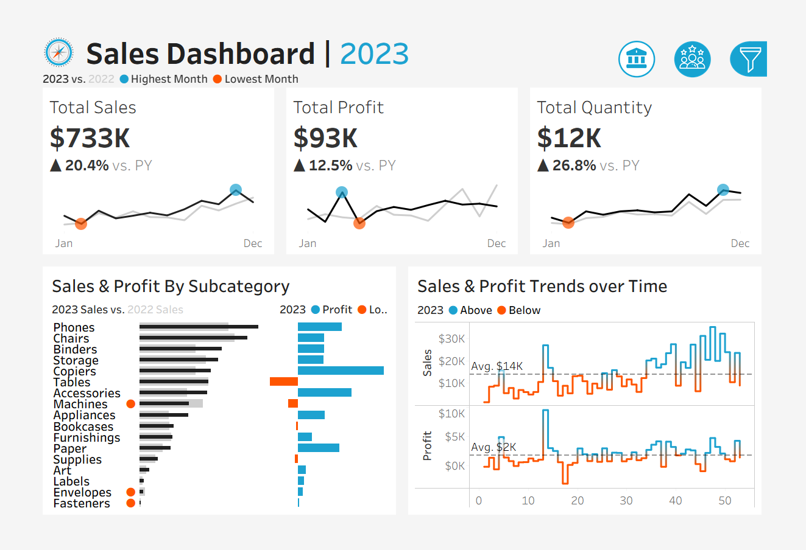
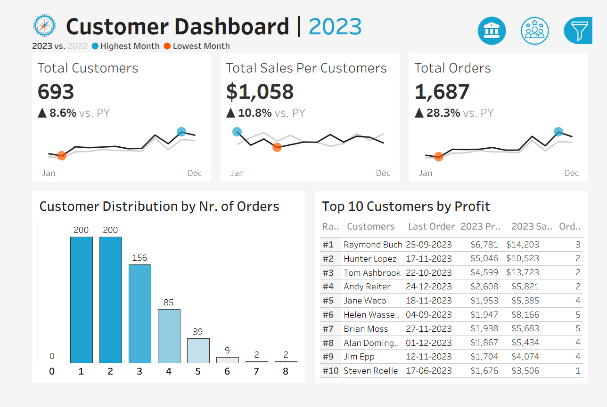

# 📊 Sales & Customer Dashboard | Tableau

An interactive Business Intelligence dashboard built in **Tableau** to analyze sales performance, customer behavior, product performance, and regional trends. This project transforms raw sales data into meaningful business insights through interactive visualizations and KPIs.

---

## 📌 Project Overview

The Sales & Customer Dashboard provides a comprehensive view of business performance by combining sales, customer, product, and location data into an interactive Tableau dashboard.

The dashboard enables users to:

- Monitor overall sales performance
- Track profit and revenue trends
- Analyze customer purchasing behavior
- Compare regional performance
- Identify top-performing products
- Support business decision-making through interactive visualizations

---

## 🎯 Business Problem

Businesses generate large amounts of sales data, making it difficult to identify performance trends and make informed decisions.

This dashboard solves that problem by providing a centralized view of important business metrics, allowing stakeholders to quickly identify opportunities, monitor KPIs, and improve decision-making.

---

## 📊 Dashboard Features

### 📈 Sales Dashboard

- Total Sales KPI
- Total Profit KPI
- Total Orders
- Sales Trend Analysis
- Profit Trend Analysis
- Category Performance
- Sub-Category Analysis
- Regional Sales Analysis
- Interactive Filters

### 👥 Customer Dashboard

- Customer Overview
- Customer Segmentation
- Top Customers
- Customer Sales Analysis
- Customer Profit Analysis
- Customer Purchase Trends
- Interactive Filtering

---

## 📂 Dataset Information

The project uses four datasets:

| Dataset | Description |
|----------|-------------|
| Orders.csv | Sales transaction data |
| Customers.csv | Customer information |
| Products.csv | Product details |
| Location.csv | Geographic and regional information |

---

## 🛠️ Tools & Technologies

- Tableau
- Microsoft Excel / CSV
- Data Visualization
- Business Intelligence (BI)
- Dashboard Design
- Data Analysis

---

## 📷 Dashboard Preview

### 📈 Sales Dashboard



---

### 👥 Customer Dashboard



---

## 📁 Project Structure

```
Sales-Dashboard-Tableau/
│
├── Dashboard/
│   └── Sales & Customer Dashboards.twbx
│
├── Data/
│   ├── Orders.csv
│   ├── Customers.csv
│   ├── Products.csv
│   └── Location.csv
│
├── Images/
│   ├── Sales-Dashboard.png
│   └── Customer-Dashboard.png
│
├── README.md
└── LICENSE
```

---

## 📈 Key Business Insights

- Identified top-performing products based on sales and profit.
- Compared regional sales performance to identify high-performing locations.
- Analyzed customer purchasing behavior and spending patterns.
- Evaluated category and sub-category performance.
- Monitored sales and profit trends over time.
- Built interactive dashboards to support business decision-making.

---

## 🚀 Skills Demonstrated

- Data Cleaning
- Data Visualization
- Dashboard Development
- Business Intelligence
- KPI Design
- Sales Analysis
- Customer Analysis
- Tableau Dashboard Design
- Storytelling with Data

---

## ▶️ How to Use

1. Download or clone this repository.
2. Open the Tableau workbook (`.twbx`) using Tableau Desktop or Tableau Public.
3. Explore the dashboards using interactive filters and visualizations.

---

## 🔮 Future Improvements

- Add forecasting for future sales.
- Connect the dashboard to a live SQL database.
- Add advanced Tableau parameters and calculated fields.
- Publish the dashboard on Tableau Public.

---

## 👨‍💻 Author

**Karan Chavan**

- GitHub: https://github.com/karankchavan416

---
⭐ If you found this project useful, consider giving it a star!
